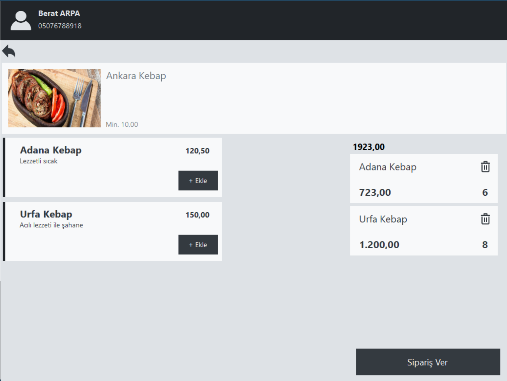

# Restaurant-Management-With-Azure

## About

This project is a restaurant management system developed in a multi-tier architecture with Azure. The application provides different functionalities for restaurant owners and customers.

## Screenshot


## Features

### Customer Features
- **Customer Registration**: Register new customers.
- **Customer Login**: Allow registered customers to log in.
- **Place Orders**: Customers can place orders for products.

### Restaurant Owner Features
- **Restaurant Owner Registration**: Register new restaurant owners.
- **Restaurant Owner Login**: Allow registered restaurant owners to log in.
- **Add Restaurant**: Restaurant owners can add new restaurants.
- **Add Category**: Restaurant owners can add new categories to their restaurants.
- **Add Product**: Restaurant owners can add new products to their restaurants.
- **Manage Orders**: Restaurant owners can manage orders.
- **Set Restaurant Status**: Restaurant owners can set their restaurants as open or closed.
- **Update Account Information**: Users can update their account information.

## Technologies Used
- **C# WinForms**: Application interface.
- **Azure**: Database and other cloud services.
- **SQL**: For database management.
- **Entity Framework**: Used as an ORM tool.
- **Multi-Tier Architecture**: Application is divided into logical layers.

## Installation

1. **Clone the Repository**:
    ```sh
    git clone https://github.com/BeratARPA/Restaurant-Management-With-Azure.git
    ```
2. **Open with Visual Studio**: Open the project with Visual Studio.
3. **Install Dependencies**: Install project dependencies.
4. **Configure Azure Connection Settings**: Configure the connection settings for Azure SQL Database and other services.
5. **Update Database**:
    ```sh
    Update-Database
    ```
6. **Run the Project**: Press F5 to run the project.

## Usage

1. **Customer Registration/Login**: Register or log in as a customer from the customer interface of the application.
2. **Place Orders**: After logging in, select products and place an order.
3. **Restaurant Owner Registration/Login**: Register or log in as a restaurant owner.
4. **Restaurant and Product Management**: Add restaurants, categories, and products, and manage orders.
5. **Update Restaurant Status**: Set your restaurant as open or closed.
6. **Update Account Information**: Update your account information.

## Contributing

If you would like to contribute, please open a pull request or create an issue.

## License

This project is licensed under the MIT License. See the [LICENSE](LICENSE) file for more details.

## Contact

For questions or feedback, feel free to contact me:
- **Email**: [beratarpa@hotmail.com](mailto:beratarpa@hotmail.com)
- **GitHub**: [https://github.com/BeratARPA/Restaurant-Management-With-Azure](https://github.com/BeratARPA/Restaurant-Management-With-Azure)

## Screenshots

Please add screenshots of your project in action here.
